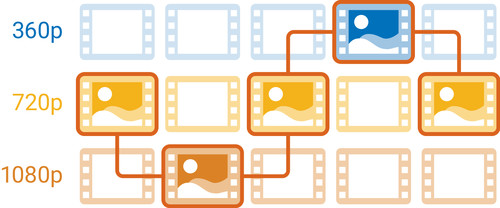
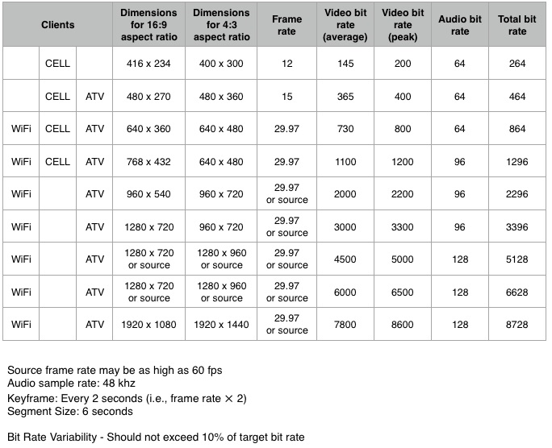

# Adaptive Streaming
This is an experiment, about
 - DASH & HLS
 - Generation of DASH & HLS contents
 - How to play them in various browsers
 
Note: *This doesn't cover any video encryption method*

    
## The Theory
The idea is to create multiple versions of the same content with different bitrates/resoultion further chop them into segments. All these informations put together in the manifest file (.mpd or .m3u8) which is the entry file for the video

## About the technologies
Adaptive streaming has been in web quite a while. There're several solution out there
- **DASH** the official International Standard
- **HLS** from Apple
- **Smooth streaming** from Microsoft
- **HDS** from Adobe

However, DASH & HLS (for Apple devices) are the main players in the web right now

## About HLS
HLS(Http Live Streaming) is the standard created by Apple. All Apple devices have native support for hls playback. It uses MPEG-2 TS segment format.

## About DASH
DASH(Dynamic Adaptive Streaming over HTTP) is the open international standard. It combines best features of HTTP-based adaptive streaming teachnologies. There isn't any native implementation in browsers yet. But, we can play dash content using Media Source Extenstion(MSE) API available in browsers. Smart TVs released after 2012, Chromecast have native support though. Visit [this page](https://bitmovin.com/mpeg-dash-browser-support-device-compatibility) for a comprehensive list of device support. It uses FMP4(fragmented mp4/ISOBMFF) or MPEG-2 TS segment format.

 [shakaplayer](https://github.com/google/shaka-player), [videojs with videojs-dash](https://github.com/videojs/videojs-contrib-dash) are most popular implementations. All the logics (Manifest parsing,  Bandwidth determination, etc) are handled by these player libraries. These players can also play HLS contents with proper setup
 

## About HLS with FMP4 container
Apple has started to use FMP4 container(the one DASH uses) from 2016. Apple was using MPEG-TS segments previously which is less efficient than FMP4 segments interms of filesize & parsing time. So,
- HLS uses the same segment files of DASH. We don't need seperate segment files for HLS
- Browsers can play HLS more efficiently. It need not to process the TS segments in javascript, incase we use HLS in non Mac/iOS safari browsers (because other browsers don't have native TS support)

[Visit this page](https://bitmovin.com/halve-encoding-packaging-storage-costs-hls-fragmented-mp4) for more information.

Note: *The support is available from ios10+, MacOS Safari 10+, tvOS*

## Generate DASH & HLS content
A node module `abr-factory` is available in **generator** directory. 
It creates requested multi-bitrate DASH & HLS content.
More details can be found in **README.md** in **generator** directory

## How to play these contents?
Apple supports HLS out of the box. So, call the master playlist(.m3u8) in video source should work.

Other browsers don't support DASH/HLS native playback yet. There're many js implementations are out. They all depend on browsers **Media Source Extenstions (MSE)** API. Browsers that don't have this api, can't play these contents. Its required to use mp4 fallback for legacy browsers.

Few popular implementations:
 - [Google's shakaplayer](https://github.com/google/shaka-player) - it has limitations with HLS
 - video.js with the help of **[videojs-contrib-dash](https://github.com/videojs/videojs-contrib-dash)**, **[videojs-contrib-hls](https://github.com/videojs/videojs-contrib-hls)** plugins
 - JWPlayer with appropriate plugins

## Cloud Services
For apps primarily use videos, Its recommended to use cloud services such as
[Bitmovin](http://www.bitmovin.com), [Amazon Elastic Transcoder](https://aws.amazon.com/elastictranscoder/)

## Encoding Recommendations

## Resources
- https://bitmovin.com/mpeg-dash-vs-apple-hls-vs-microsoft-smooth-streaming-vs-adobe-hds/ 
- https://bitmovin.com/dynamic-adaptive-streaming-http-mpeg-dash/ - Good article about DASH syntax
- https://bitmovin.com/mpeg-dash-open-source-player-tools
- https://www.brendanlong.com/the-structure-of-an-mpeg-dash-mpd.html
- https://bitmovin.com/same-origin-policy-cors-and-crossdomain-xml-what-you-need-to-know/ - CORS
- https://developer.mozilla.org/en-US/Apps/Fundamentals/Audio_and_video_delivery/Setting_up_adaptive_streaming_media_sources
